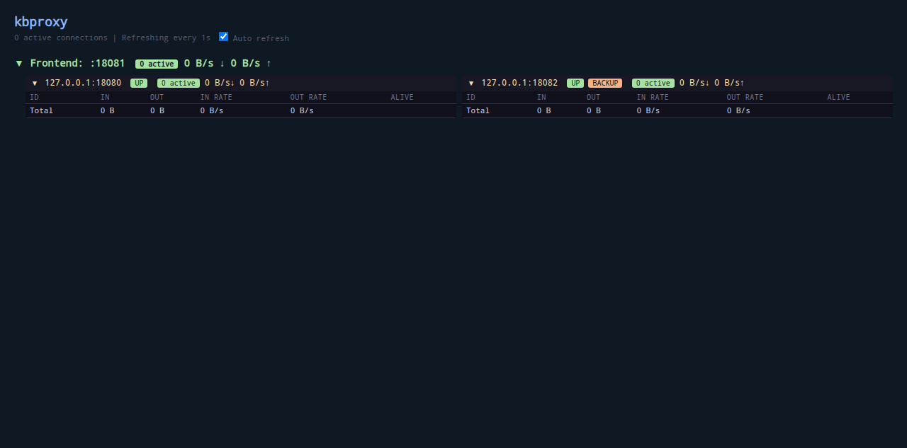

# kbproxy

轻量级反向代理，带实时流量监控面板。

## 特性

- 类似haproxy，但只代理 TCP和UDP
- 两种负载均衡策略：`least_bandwidth`（默认）、`least_conn`
- Backup 后端支持（HAProxy 风格，仅当所有主后端不可用时启用）
- 外部健康检查（自定义脚本、可配置间隔和超时）
- 内嵌 Web Dashboard，1 秒自动刷新
- 可选 Basic Auth 保护 API
- 零外部依赖，Go 标准库实现

## 截图



## 构建

```bash
go build -o kbproxy .
```

## Docker / Podman

```bash
podman build -t kbproxy .
podman run -p 8080:8080 -p 9090:9090 kbproxy \
  -frontend tcp://:8080 \
  -backend tcp://10.0.0.1:80,tcp://10.0.0.2:80
```

## 用法

```
Usage: kbproxy [flags]

Flags:
  -frontend string   Frontend URL: tcp://:8080?lb=least_conn (repeatable)
  -backend string    Comma-separated backend URLs (repeatable)
  -api string        API server listen address (default ":9090")
  -api-user string   API Basic Auth username
  -api-pass string   API Basic Auth password
  -config string     JSON config file path (enables hot reload)
```

### 基本示例

```bash
kbproxy \
  -frontend tcp://:8080 \
  -backend tcp://10.0.0.1:80,tcp://10.0.0.2:80
```

### 多前端

```bash
kbproxy \
  -frontend tcp://:8080?lb=least_conn \
  -backend tcp://10.0.0.1:80,tcp://10.0.0.2:80 \
  -frontend tcp://:9090 \
  -backend tcp://10.0.0.3:3306
```

### Backup 后端

```bash
kbproxy \
  -frontend tcp://:8080 \
  -backend tcp://10.0.0.1:80,tcp://10.0.0.2:80,tcp://10.0.0.3:80?backup
```

`10.0.0.3` 标记为 backup，仅当 `10.0.0.1` 和 `10.0.0.2` 都不可用时才启用。

### 健康检查

```bash
kbproxy \
  -frontend tcp://:8080 \
  -backend "tcp://10.0.0.1:80?check=/usr/local/bin/check.sh&inter=10&check_timeout=3"
```

| 参数 | 说明 |
|------|------|
| `check` | 健康检查脚本路径，退出码 0 为健康 |
| `inter` | 检查间隔（秒），默认 60 |
| `check_timeout` | 检查超时（秒），默认 5 |

### 配置文件

使用 JSON 配置文件代替命令行参数，支持热重载（修改文件后自动生效，无需重启）：

```bash
kbproxy -config kbproxy.json
```

配置文件格式：

```json
{
  "api": ":9090",
  "api_user": "",
  "api_pass": "",
  "frontends": [
    {
      "url": "tcp://:8080?lb=least_conn",
      "backends": ["tcp://10.0.0.1:80?weight=3", "tcp://10.0.0.2:80?backup"]
    }
  ]
}
```

`frontends[].url` 和 `backends[]` 的参数格式与命令行一致。

**热重载：**

- 修改配置文件后 5 秒内自动生效
- 新增前端：立即开始监听
- 移除前端：停止接受新连接，已有连接优雅等待关闭（最多 30 秒）
- 后端增删改：即时生效，移除的后端不再接受新连接
- API 地址变更不支持热重载，需重启
- 也可通过 `POST /api/reload` 手动触发重载

**注意：** `-config` 与 `-frontend`/`-backend` 互斥，不能同时使用。

### 后端权重

```bash
-backend tcp://10.0.0.1:80?weight=3,tcp://10.0.0.2:80?weight=1
```

### 带宽测试

内置 `/api/test` 接口，可用来测试客户端与服务之间的带宽：

```bash
# 默认下载 100MB
wget http://localhost:9090/api/test

# 自定义大小（字节）
wget "http://localhost:9090/api/test?size=524288000"
```

## API

| 端点 | 说明 |
|------|------|
| `GET /` | Web Dashboard |
| `GET /api/connections` | 活跃连接列表 |
| `GET /api/stats` | 前端/后端统计信息 |
| `GET /api/test?size=N` | 带宽测试下载 |
| `POST /api/reload` | 手动触发配置重载（需 -config 模式） |

## Dashboard

启动后访问 `http://<api-addr>/` 即可打开监控面板，展示：

- 各前端（Frontend）的活跃连接数和速率
- 各后端（Backend）的健康状态、连接数、速率
- 每条连接的实时流量详情
- Backup 后端橙色标签标识
- 健康检查状态和下次检查倒计时
